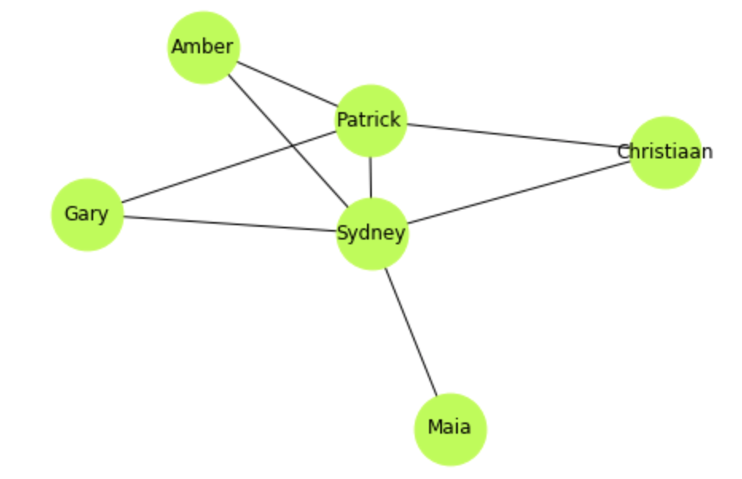
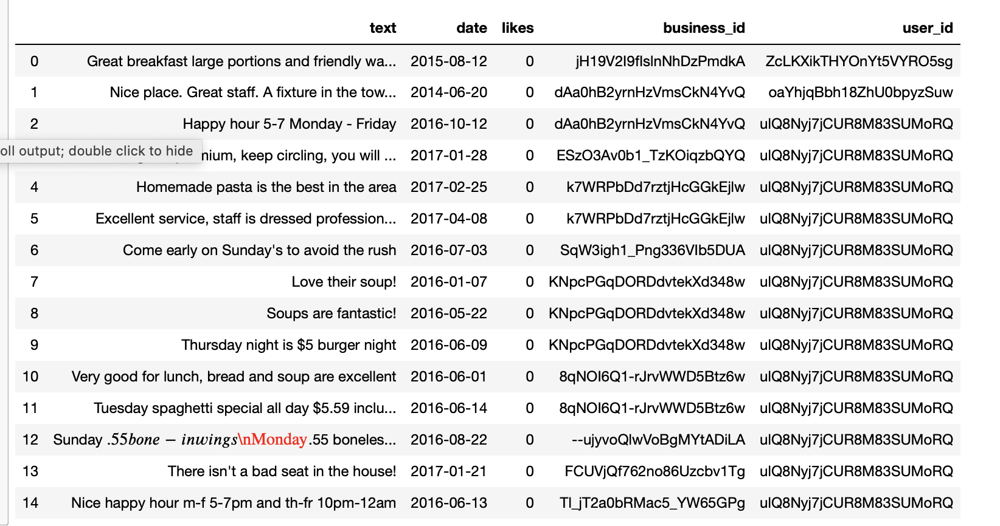
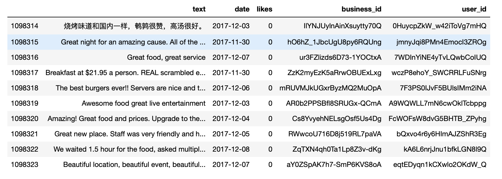
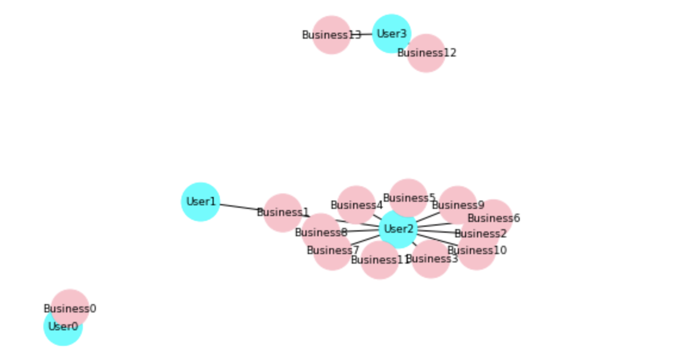
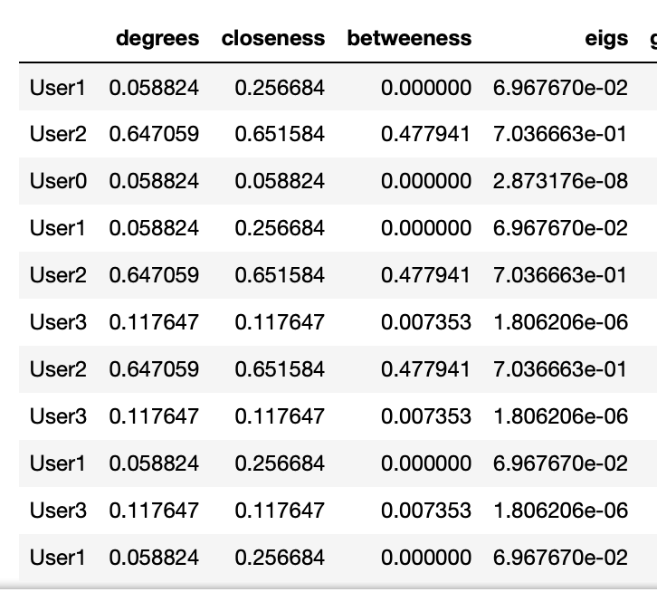

# Networkx-Centrality
NetworkX is a Python library package used to create, manipulate, and study the structure and functions of a complex networks. There are two part in this study. The first is to create a friendship network between cohort mates at the Flatiron School, The second with a much larger scale is to measure the closeness centrality and betweenness centrality among business entities and users. 
Objectives:
  1. For a small cohort mates network at Flatiron School - Data Science Program
     a. Create basic network graphs with networkx
     b. Add nodes and edges to networkx 
     c. Visualize network graphs with networkx
  2. In a larger scale, a yelp review file that contains more than 1 million reviews, we
    a. Identify business entities and users
    b. Create network graph with networkx
    c. Add nodes and edges to networkx
    d. Visualize network graph with networkx
    e. Construct a dataframe that measure degree centrality, closeness centrality,betweenness centrality,and eigenvector              centrality.
    
 Networkx depicts the relationship between cohort mates at Flatiron School- Data Science Program
    
 Let's take a look at the first 15 rows and the last 10 rows of the "yelp review) file
    
    
 And now we can graph the relationships among business entities and users based on the strong/weakness of the reviews.
    
    
  Finally, after much work, we have constructed a dataframe/table that summarizes the closeness and betweenness-centrality.
     
 
    
